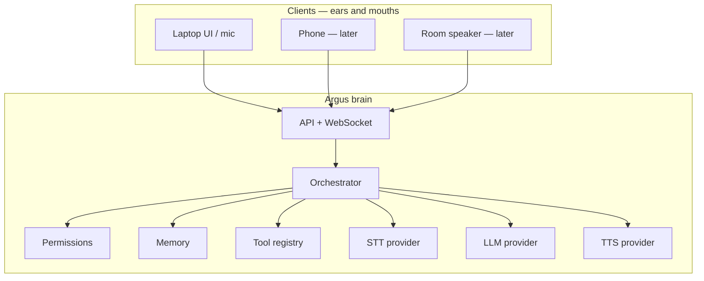
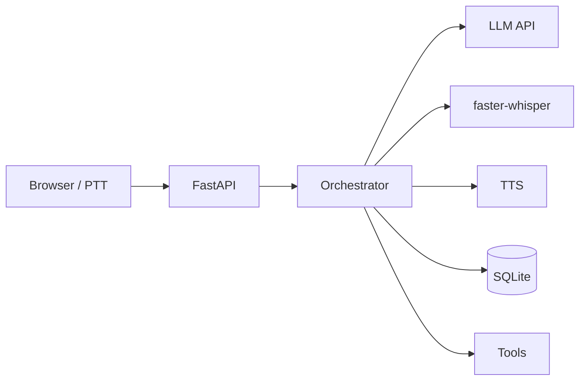
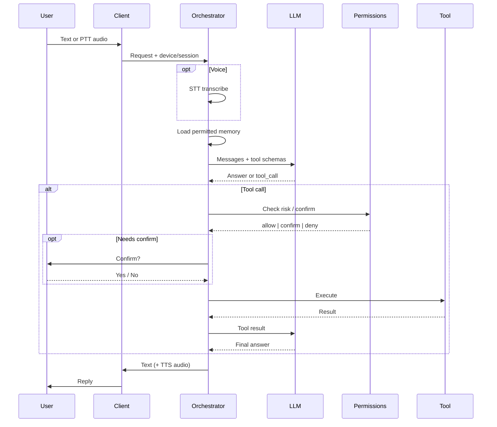
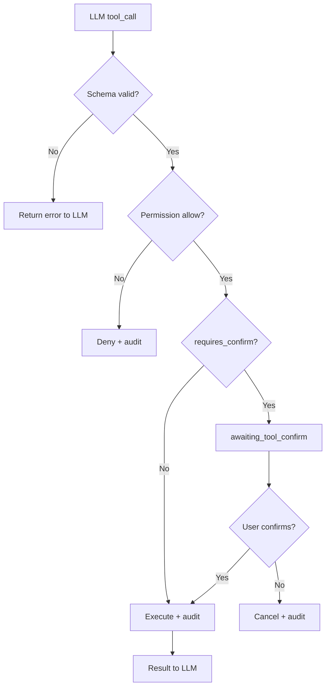
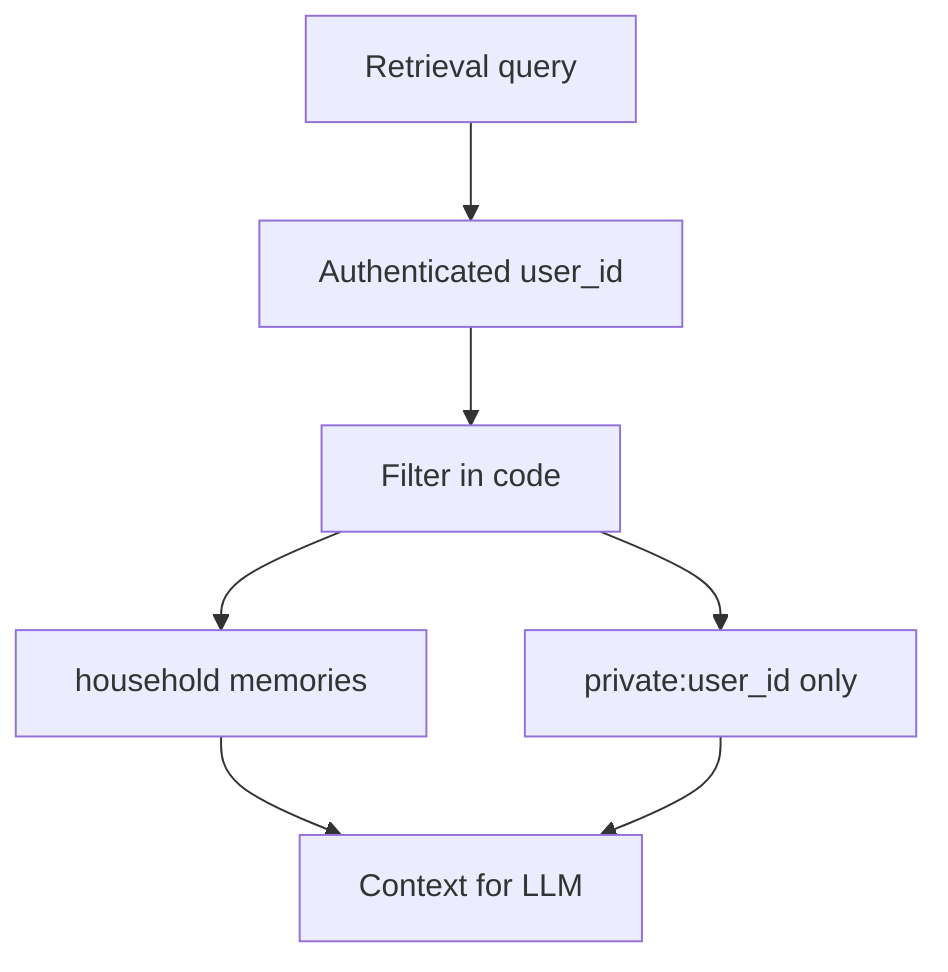
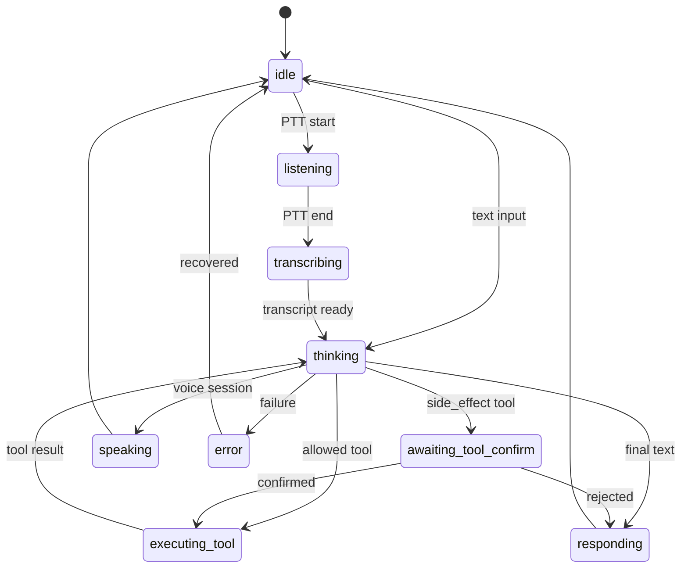

# Diagrams

Mermaid diagrams for Argus. Edit here; render in GitHub / VS Code / Cursor preview.

## 1. System context (target)

## 2. V0 laptop slice

## 3. Request lifecycle

## 4. Permission flow

## 5. Memory scopes (target model)

V0 uses a single-user notes store; this diagram is the intended end state so we do not paint ourselves into a corner.

## 6. Orchestrator states

